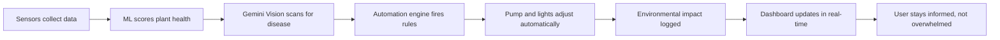
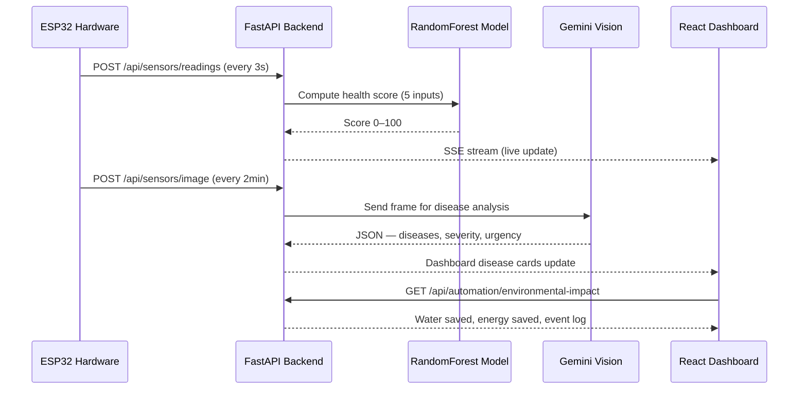
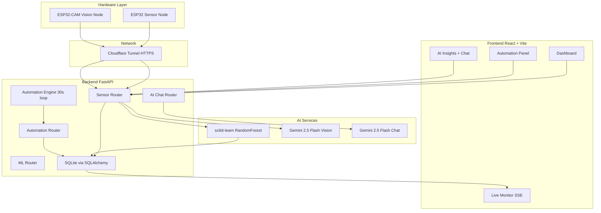
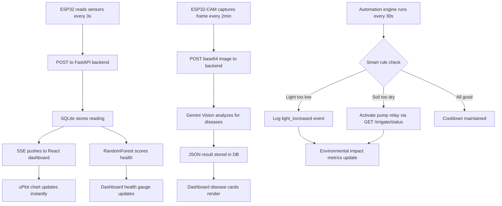
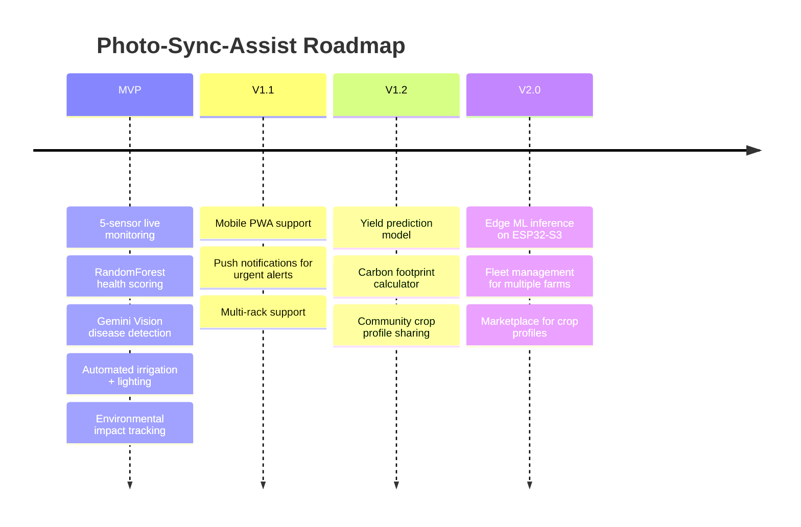

<div align="center">

# 🌿 Photo-Sync-Assist
### *Intelligent Vertical Farming — Real Hardware, Real AI, Real Results*

<p align="center">
  
  
  
  
  
</p>

<p align="center">
  
  
  
  
  
</p>

---

### Stop guessing. Start growing.
An end-to-end vertical farming platform that combines **affordable ESP32 hardware**, **ML-powered plant health scoring**, **AI crop disease vision**, and **fully automated irrigation and lighting** — so anyone can run a data-driven farm without deep agricultural expertise.

</div>

---

## ✨ Overview

**Photo-Sync-Assist** makes precision vertical farming achievable for hobbyists, campus greenhouses, and urban farmers by closing the feedback loop between sensor data and physical action:

- **Monitor** → 5-sensor real-time telemetry streamed live to the dashboard
- **Analyze** → ML health scoring + Gemini Vision disease detection on every camera frame
- **Act** → automated pump and light control with cooldown-aware smart rules
- **Minimize** → measurable water and electricity savings tracked as environmental impact
- **Scale** → crop profiles for any plant type, any rack count

> If farms produce less because managing them is **confusing, manual, and wasteful**, Photo-Sync-Assist turns it into a **guided, automated, AI-assisted operation**.

---

## 🧩 Product Components

### 1) 🔌 Hardware Layer (`hardware/`)
The physical nerve system of the farm.

| Device | Role |
|--------|------|
| **ESP32** | Core MCU — reads all sensors, controls pump relay, syncs with backend |
| **ESP32-CAM** | Captures rack images every 2 minutes, streams to Gemini Vision |
| **DHT11** | Temperature + ambient humidity |
| **Capacitive Soil Sensor** | Soil moisture % (GPIO 34) |
| **pH Probe + ADC** | Water/soil pH level (GPIO 35) |
| **LDR (Light-Dependent Resistor)** | Ambient light % (GPIO 32) |
| **Relay Module** | Controls water pump — ON/OFF via backend automation |
| **Cloudflare Tunnel** | Exposes backend over HTTPS so ESP32 can reach it from anywhere |

> All hardware is off-the-shelf and costs under $30 total — making this an **affordable IoT solution** accessible to anyone.

---

### 2) 🧠 AI & ML Layer

#### Health Score — RandomForest Model
**Model:** scikit-learn `RandomForestRegressor` trained on `Smart_Farming_dataset.csv`

Computes a **composite plant health score (0–100)** from all 5 sensor channels simultaneously:

| Input | Weight | What it captures |
|-------|--------|-----------------|
| Temperature (°C) | 22.5% | Heat stress / cold shock |
| Humidity (%) | 22.5% | Transpiration & mold risk |
| Soil Moisture (%) | 22.5% | Root saturation / drought |
| pH Level | 22.5% | Nutrient uptake efficiency |
| Light (%) | 10% | Photosynthesis adequacy |

Scores are crop-specific — optimal ranges differ between Wheat, Maize, Soybean, Cotton, and more.

---

#### Computer Vision — Crop Disease Detection
**Model:** `gemini-2.5-flash` (multimodal)

Every ESP32-CAM frame is analyzed by Gemini Vision and returns structured JSON:

```json
{
  "overall_health": "Moderate",
  "summary": "Early signs of leaf spot on lower leaves",
  "urgent_action": "Reduce humidity below 70%",
  "diseases": [
    {
      "name": "Cercospora Leaf Spot",
      "severity": "Low",
      "confidence": 0.82,
      "affected_area_pct": 12,
      "recommendation": "Apply copper-based fungicide, improve airflow"
    }
  ]
}
```

The dashboard displays per-disease cards with severity badges, confidence scores, and affected area progress bars — catching problems **before they spread**.

---

#### AI Insights & Chat
**Model:** `gemini-2.5-flash` (conversational)

An in-app AI assistant answers farm-specific questions grounded in current sensor readings:
- *"Why is my pH dropping this week?"*
- *"Should I increase watering for these temperatures?"*
- *"What's the optimal light schedule for maize?"*

---

### 3) ⚙️ Automation Engine (`backend/services/automation_engine.py`)
A background task loop running every 30 seconds with cooldown-aware smart rules:

| Trigger | Condition | Action | Cooldown |
|---------|-----------|--------|----------|
| **Low light** | Light < 30% | Increase grow light | 120 min |
| **Excess light** | Light > 80% | Reduce grow light | 120 min |
| **Drought + bad pH** | Soil < 25% AND pH out of range | Skip irrigation (log event) | 60 min |
| **Irrigation trigger** | Soil moisture below crop threshold | Activate pump | Configurable |

Every action is logged as an `AutomationEvent` — visible in the **Environmental Impact** dashboard so users can see exactly how much water and electricity is being saved.

---

### 4) 🖥 Web Dashboard (`frontend/`)
A React single-page application with real-time SSE streaming — no page refreshes, no polling lag.

| Page | What you see |
|------|-------------|
| **Dashboard** | 5 KPI cards + health gauge + Rack Camera + live disease analysis |
| **Live Monitor** | Real-time uPlot chart per sensor, Raw Sensor Data table |
| **Automation** | Environmental impact cards, Irrigation Reports, Light Control Reports, Manual pump control |
| **AI Insights** | Bar/doughnut analytics charts + Gemini chat |
| **Crops** | Per-crop optimal ranges, yield targets |
| **Alerts** | Threshold-based alert history |
| **Reports** | Exportable historical reports |

---

## 🚀 Core Value Loop



---

## 🧠 AI Workflow



---

## 🏗 System Architecture



---

## 🌱 Why This Matters

### The Problem

Manual vertical farming fails at scale because of constant friction:

- 🌡 **"Is the temperature right for this crop?"**
- 💧 **"Did I over-water or under-water today?"**
- 🧪 **"Why are the leaves yellowing?"**
- 💡 **"Are the lights running longer than they need to?"**

These questions cost time, expertise, and money — and wrong answers cost yields.

### The Solution

Photo-Sync-Assist eliminates the guesswork:

- Every sensor streams live — no manual checks
- ML fires before problems become visible
- AI vision catches disease at 12% affected area, not 80%
- Automation acts before the crop suffers — and logs every liter and kilowatt-hour saved

---

## 🌍 SDG Alignment

| Goal | How Photo-Sync-Assist contributes |
|------|--------------------------|
| **SDG 2 — Zero Hunger** | Higher yields through data-driven precision farming |
| **SDG 11 — Sustainable Cities** | Enables urban vertical farming in limited spaces |
| **SDG 13 — Climate Action** | Minimizes water waste and energy consumption through smart automation |

---

## 🧰 Tech Stack

### Hardware
- **ESP32** — WiFiClientSecure + HTTPClient + ArduinoJson
- **ESP32-CAM** — base64 image capture → POST to backend
- **DHT11** — temperature + humidity
- **Capacitive Soil Moisture Sensor**
- **pH Probe** + voltage divider ADC
- **LDR** — ambient light %
- **5V Relay Module** — pump control

### Backend
- **FastAPI** (Python 3.11+)
- **SQLAlchemy** (async) + **aiosqlite** + **SQLite**
- **Server-Sent Events (SSE)** — real-time sensor streaming
- **Docker** — containerized deployment

### Frontend
- **React 18** + **Vite**
- **Zustand** — global state management
- **uPlot** — zero-flicker real-time sensor charts
- **Chart.js** — analytics bar/doughnut charts
- **Lucide React** — icons

### AI & ML
- **scikit-learn** — RandomForest health score model
- **Google Gemini 2.5 Flash** — crop disease vision analysis
- **Google Gemini 2.5 Flash Lite** — AI chat assistant

### Infrastructure
- **Cloudflare Tunnel** — HTTPS tunnel for ESP32 → backend connectivity
- **Docker Compose** — one-command deployment

---

## 📊 Supported Crop Profiles

Photo-Sync-Assist ships with pre-configured optimal sensor ranges derived from the Smart Farming dataset:

| Crop | Temp (°C) | Humidity (%) | Soil Moisture (%) | pH | Light (%) |
|------|-----------|--------------|-------------------|----|-----------|
| **Wheat** | 18–25 | 50–72 | 20–38 | 6.0–7.0 | 50–75 |
| **Maize** | 20–30 | 55–78 | 20–38 | 5.8–7.0 | 46–71 |
| **Soybean** | 20–30 | 55–80 | 18–38 | 6.0–7.2 | 46–71 |
| **Cotton** | *configured* | *configured* | *configured* | *configured* | *configured* |
| **+ more** | Add via Crop Manager | | | | |

Each crop has `avg_yield` and `top25_yield` targets — the health score tells you how far you are from peak.

---

## ⚙️ Prerequisites

Before running Photo-Sync-Assist, ensure you have:

- **Python 3.11+**
- **Node.js 18+**
- **Docker + Docker Compose** *(optional but recommended)*
- **Google Gemini API key** (from Google AI Studio)
- *(Optional)* **Cloudflare Tunnel** for ESP32 remote connectivity

---

## 🚀 Setup Guide

### 1) Clone the Repository

```bash
git clone <repository-url>
cd Photo-Sync-Assist
```

---

### 2) Configure Environment

Create `backend/.env`:

```env
GEMINI_API_KEY=YOUR_GEMINI_API_KEY
MOCK_SENSORS=false
MOCK_IMAGES=false
```

> Set `MOCK_SENSORS=true` and `MOCK_IMAGES=true` to run the full dashboard without any hardware connected — great for demos.

---

### 3) Run with Docker *(Recommended)*

```bash
docker-compose up --build
```

- Backend → `http://localhost:8000`
- Frontend → `http://localhost:5173`

---

### 4) Run Manually

#### Backend
```bash
cd backend
pip install -r requirements.txt
uvicorn main:app --reload
```

#### Frontend
```bash
cd frontend
npm install
npm run dev
```

---

### 5) Configure Hardware

#### Sensor Node (`hardware/Sync-Assist/`)

Edit the top of `Sync-Assist.ino`:

```cpp
#define WIFI_SSID     "YOUR_WIFI_NAME"
#define WIFI_PASSWORD "YOUR_WIFI_PASSWORD"
#define BACKEND_URL   "https://your-cloudflare-tunnel.trycloudflare.com"
```

Flash to ESP32 via Arduino IDE.

#### Camera Node (`hardware/Sync-Assist-CAM/`)

Same WiFi + backend URL configuration. Flash to ESP32-CAM.

> The sensor node sends readings every **3 seconds**. The camera node captures and uploads a frame every **2 minutes**.

---

### 6) Cloudflare Tunnel *(for remote ESP32 connectivity)*

```bash
./cloudflared-windows-amd64.exe tunnel --config config.yml run
```

This exposes the FastAPI backend over HTTPS so the ESP32 can reach it outside your local network.

---

## 🔐 Security Notes

Never commit:
- `backend/.env` — Gemini API key
- Firebase service account JSON *(if migrating from a Firebase setup)*
- `config.yml` with tunnel tokens

---

## 🧪 Development Notes

### Mock Mode — No Hardware Needed

Run without any physical sensors or camera:

```env
MOCK_SENSORS=true
MOCK_IMAGES=true
```

The backend generates realistic sensor readings and serves sample plant images from `backend/mock_images/` — full dashboard, full AI analysis, zero hardware.

---

### Retrain the ML Model

```bash
cd backend/ml
python train.py
```

Reads from `Smart_Farming_dataset.csv`, retrains per-crop RandomForest models, and saves them to `saved_models/`.

---

## 📦 Repository Structure

```
Photo-Sync-Assist/
├── backend/
│   ├── main.py                     # FastAPI app entry point
│   ├── config.py                   # Settings (env vars)
│   ├── routers/
│   │   ├── sensors.py              # Sensor readings, SSE stream, image upload
│   │   ├── automation.py           # Rules, events, environmental impact
│   │   ├── ml_router.py            # Health score endpoint
│   │   ├── ai_chat.py              # Gemini chat endpoint
│   │   └── crops.py                # Crop profile management
│   ├── services/
│   │   ├── automation_engine.py    # 30s background rule loop
│   │   ├── gemini_vision_service.py # Gemini 2.5 Flash image analysis
│   │   └── gemini_service.py       # Gemini chat service
│   ├── ml/
│   │   ├── health_score.py         # Composite score calculation
│   │   ├── crop_params.py          # Per-crop optimal ranges
│   │   └── train.py                # Model training script
│   └── mock_images/                # Sample images for mock mode
│
├── frontend/
│   └── src/
│       ├── pages/
│       │   ├── Dashboard.jsx       # KPI cards, camera, health gauge
│       │   ├── LiveMonitor.jsx     # Real-time sensor charts (SSE)
│       │   ├── Automation.jsx      # Environmental impact + reports
│       │   └── AIInsights.jsx      # AI chat + analytics
│       ├── store/
│       │   └── farmStore.js        # Zustand global state
│       └── lib/
│           └── api.js              # API client
│
├── hardware/
│   ├── Sync-Assist/                # ESP32 sensor + pump node
│   └── Sync-Assist-CAM/            # ESP32-CAM vision node
│
├── Smart_Farming_dataset.csv       # Training data for ML models
├── docker-compose.yml
└── config.yml                      # Cloudflare tunnel config
```

---

## 🔄 End-to-End Data Flow



---

## 🧭 Roadmap



---

## 🏆 What Makes Photo-Sync-Assist Different

This is not a sensor dashboard with a chart.

| Layer | What we built |
|-------|--------------|
| **Hardware** | Real ESP32 nodes, real sensors, real relay pump — not simulated |
| **ML** | Crop-specific RandomForest trained on real farming data — not thresholds |
| **Vision** | Gemini 2.5 Flash disease analysis with per-disease confidence and recommendations |
| **Automation** | Cooldown-aware rule engine that logs every liter and kilowatt saved |
| **UX** | Zero-expertise required — a health score of 73 tells you more than raw pH |
| **Affordability** | Full hardware bill under $30 — accessible to anyone with a grow rack |
| **Scalability** | Add a crop profile, add a rack — the platform adapts |

---

## 🤝 Team

```
Moroz Fedor  — Backend / Frontend / Hardware
```

<div align="center">

## 🌿 Grow smarter. Waste less. Harvest more.
## 🤖 Let AI watch the farm while you focus on what matters.
## 💡 From a $30 ESP32 to a precision vertical farm.

**Photo-Sync-Assist — Precision Farming for Everyone.**

</div>
